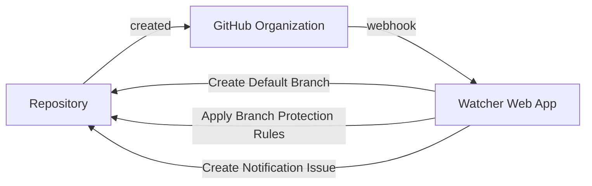

# GitHub Watcher for Organizations

**Notice**: The contents of this repository are meant for reference example only and should not directly be used in a production environment without additional testing and validation.

- [GitHub Watcher for Organizations](#github-watcher-for-organizations)
  - [Overview](#overview)
  - [Requirements](#requirements)
  - [Usage](#usage)
    - [Usage - Workflow Dispatch](#usage---workflow-dispatch)
      - [Components - Workflow Dispatch](#components---workflow-dispatch)
      - [Workflow Configuration - Workflow Dispatch](#workflow-configuration---workflow-dispatch)
    - [Usage - Standalone Web Application](#usage---standalone-web-application)
      - [Components - Standalone Web Application](#components---standalone-web-application)
      - [Getting Started - Standalone Web Application](#getting-started---standalone-web-application)
      - [Deploy Web App - Standalone Web Application](#deploy-web-app---standalone-web-application)
      - [Setting up the GitHub Organization Webhook - Standalone Web Application](#setting-up-the-github-organization-webhook---standalone-web-application)
  - [References](#references)
  - [License](#license)

## Overview

The purpose of this repository is to serve as a reference example for setting up automated validation and enforcement of GitHub Repository settings within a target Organization.  The primary functionality is to create a web application which can consume webhooks from a GitHub organization to verify that newly-created repositories have a default branch with branch protection rules in place.

This example repository uses **Node.js** to communicate with the GitHub REST API using the [GitHub REST API client for JavaScript](https://github.com/octokit/rest.js) from [Octokit](https://github.com/octokit).

- [watcher.js](./watcher.js): Contains functional logic and module exports which are consumed by other application files to apply configuration settings across Repositories and associated Branches within an Organization.
- `index.js`: **Node.js** app file leveraging _Express_ for creating a listener web application to consume [webhooks](https://docs.github.com/en/developers/webhooks-and-events/webhooks) from a GitHub Organization when a new repository has been created.  When a _webhook_ is received with an _action_ of `created`, this web app will verify that there is a default branch created (or create one with a minimal `README.md`) and apply baseline repository and branch configuration settings, consuming request body data and Environment variables to perform targeted actions.
- [github-action.js](./github-action.js): (**TODO: Documentation is not yet completed for this component**) **Node.js** app file meant to use for batch processing to scan multiple repositories within an organization to verify baseline configurations are in place.  The format of this file is meant to be used as a Workflow within a GitHub Action with associated Environment variables provided from the Workflow.

## Requirements

- **Node.js**: Used for local development and to run `index.js` as a web app.  Tested with `v16.14.2` of **Node.js** with **npm** version `8.6.0`.  Refer to the [Node.js Docs Site](https://nodejs.org/en/) for installation details.
- **GitHub Organization**:  A GitHub Organization is required to use examples within this repository.  It is strongly encouraged to use a dedicated testing organization first so that changes are not accidentally introduced into primary organizations and associated repositories.
- **Github Access**: Requires Organization Administrative rights for setting up an organization webhook.
- **GitHub Organization Webhook**:  A Webhook will be used with the GitHub organization to communicate trigger events to the Web App included with this repository.
- **GitHub App**: Communications with the GitHub REST API require authenticated access for components used with this example.  See [GitHub App Docs](https://docs.github.com/en/developers/apps/managing-github-apps) for setup.
  - GitHub App should have permissions:
    - `Repository` -> `Administration`: read/write
    - `Repository` -> `Contents`: read/write
    - `Repository` -> `Metadata`: read
    - `Organization` -> `Administration`: read
- **Hosting for Web App**: To use the `index.js` sample included with this repository a hosting location is needed that is accessible from GitHub.  [Heroku](https://www.heroku.com/) was used in this example.

## Usage

### Usage - Workflow Dispatch

This example repository can be triggered with a [Workflow Dispatch](https://docs.github.com/en/actions/using-workflows/events-that-trigger-workflows#workflow_dispatch) event to directly trigger a workflow run with parameters.

#### Components - Workflow Dispatch

- [package.json](./package.json): **Node.js** app definition and source of dependencies.
- [github-action.js](./github-action.js): Entry point for the application called by `workflow_dispatch`.
- [watcher.js](./watcher.js): Contains functions and module exports which are called from [github-action.js](./github-action.js) entry point.
- Environment Variables used:
  - `GHWATCHER_BASEURL`: Used by [watcher.js](./watcher.js), GitHub Base URL for API calls.  Defaults to `https://api.github.com`.  For a GitHub Enterprise Server(GHES) installation this would be `https://FQDN-of-GHES/api/v3`.
  - `GHWATCHER_APP_ID`: **required**, Used by [watcher.js](./watcher.js), GitHub App ID for interacting with the GitHub REST API with Octokit.
  - `GHWATCHER_APP_PEM`: **required**, Used by [watcher.js](./watcher.js), GitHub App Private Key content for interacting with the GitHub REST API with Octokit.
  - `GHWATCHER_APP_INSTALLATION_ID`: **required**, Used by [watcher.js](./watcher.js), will be used to generate a short-lived token for interacting with the GitHub REST API with Octokit.
  - `GHWATCHER_ALLOWED_ORG_LIST`: **required**, Used by [index.js](./index.js) to determine if the `repository.owner.login` sent in the webhook request is matched to a valid listing of Organization names which this application is allowed to target.  Limits interactions from this application to only scan specified target Organizations which are explicitly allowed. Supports a String value either space or comma delimited.
  - `GHWATCHER_ENABLE_DEPENDABOT`: Used by [index.js](./index.js) to determine if Dependabot scanning should be enabled on repositories when applying branch protection rules, enabling by setting a String value of `true`. Default value is `null`.
  - `GHWATCHER_ENFORCE_PRIVATE`: Used by [watcher.js](./watcher.js) to determine if checks/enforcement should happen for **private** repositories, setting to value of `true` to include **private** repositories.  Default value is `false`.
  - `GHWATCHER_REPO_SKIP_LIST`: Used by [watcher.js](./watcher.js) to determine if named repositories should be skipped from checks/enforcement.  Supports a String value either space or comma delimited.

#### Workflow Configuration - Workflow Dispatch

The following shows relevant configuration options which are similar to the [watcher.yml](.github/workflows/watcher.yml) workflow located in this repository.

```yaml
on:
  # Allow for manual execution
  workflow_dispatch:
  # Execute on schedule
  schedule:
    - cron:  '30 5,17 * * *'

jobs:
  watcher_exec:
    runs-on: ubuntu-latest
    strategy:
      matrix:
        org:
          - example-org-name-1
          - example-org-name-2
        include:
          # Specify secrets for authentication to example-org-name-1
          - org: example-org-name-1
            GHWATCHER_APP_ID: GHWATCHER_APP_ID_1
            GHWATCHER_APP_PEM: GHWATCHER_APP_PEM_1
            GHWATCHER_APP_INSTALLATION_ID: GHWATCHER_APP_INSTALLATION_ID_1
          # Specify secrets for authentication to example-org-name-2
          - org: example-org-name-2
            GHWATCHER_APP_ID: GHWATCHER_APP_ID_2
            GHWATCHER_APP_PEM: GHWATCHER_APP_PEM_2
            GHWATCHER_APP_INSTALLATION_ID: GHWATCHER_APP_INSTALLATION_ID_2
    # Populate shared environment variables used by all orgs
    env:
      # Org-specific configurations can be passed as matrix-include items
      GHWATCHER_APP_ID: ${{ secrets[matrix.GHWATCHER_APP_ID] }}
      GHWATCHER_APP_PEM: ${{ secrets[matrix.GHWATCHER_APP_PEM] }}
      GHWATCHER_APP_INSTALLATION_ID: ${{ secrets[matrix.GHWATCHER_APP_INSTALLATION_ID] }}
      GHWATCHER_CHECK_ORG: ${{ matrix.org }}
      GHWATCHER_ENFORCE_PRIVATE: false
      GHWATCHER_REPO_SKIP_LIST: github-watcher-admin
      GHWATCHER_ALLOWED_ORG_LIST: ${{ matrix.org }}
      GHWATCHER_ENABLE_DEPENDABOT: true
      GHWATCHER_BASEURL: https://api.github.com
    steps:
      - uses: actions/checkout@v2
      - name: Use Node.js 16.x
        uses: actions/setup-node@v1
        with:
          node-version: 16.x
      - name: npm setup
        run: npm install
      - name: ${{ matrix.org }} - exec watcher
        run: npx node github-action.js
      - name: Summary
        run: cat ${{ matrix.org }}.md >> $GITHUB_STEP_SUMMARY

```

### Usage - Standalone Web Application

This example repository can run as a standalone web app to consume webhook events from a GitHub organization and apply default configurations to newly created repositories and their default branch.



#### Components - Standalone Web Application

- [package.json](./package.json): **Node.js** app definition and source of dependencies.  Contains `start` script to use for running the package via `nodemon` package.
- `index.js`: Entry point for the application where **Express** configuration is held.  Code logic for `/github-watcher` is defined to expect to receive a data payload from a GitHub Organization webhook event and is currently configured to only perform action for repository `created` events.
- [watcher.js](./watcher.js): Contains functions and module exports which are called from `index.js` entry point.
- Environment Variables used:
  - `GHWATCHER_PORT` (or `PORT`): **required**, Used by **Express** in `index.js` to determine what port should be used for bind when starting the application.
  - `GHWATCHER_BASEURL`: Used by [watcher.js](./watcher.js), GitHub Base URL for API calls.  Defaults to `https://api.github.com`.  For a GitHub Enterprise Server(GHES) installation this would be `https://FQDN-of-GHES/api/v3`.
  - `GHWATCHER_APP_ID`: **required**, Used by [watcher.js](./watcher.js), GitHub App ID for interacting with the GitHub REST API with Octokit.
  - `GHWATCHER_APP_PEM`: **required**, Used by [watcher.js](./watcher.js), GitHub App Private Key content for interacting with the GitHub REST API with Octokit.
  - `GHWATCHER_APP_INSTALLATION_ID`: **required**, Used by [watcher.js](./watcher.js), will be used to generate a short-lived token for interacting with the GitHub REST API with Octokit.
  - `GHWATCHER_ALLOWED_ORG_LIST`: **required**, Used by [index.js](./index.js) to determine if the `repository.owner.login` sent in the webhook request is matched to a valid listing of Organization names which this application is allowed to target.  Limits interactions from this application to only scan specified target Organizations which are explicitly allowed. Supports a String value either space or comma delimited.
  - `GHWATCHER_ENABLE_DEPENDABOT`: Used by [index.js](./index.js) to determine if Dependabot scanning should be enabled on repositories when applying branch protection rules, enabling by setting a String value of `true`. Default value is `null`.
  - `GHWATCHER_ENFORCE_PRIVATE`: Used by [watcher.js](./watcher.js) to determine if checks/enforcement should happen for **private** repositories, setting to value of `true` to include **private** repositories.  Default value is `false`.
  - `GHWATCHER_REPO_SKIP_LIST`: Used by [watcher.js](./watcher.js) to determine if named repositories should be skipped from checks/enforcement.  Supports a String value either space or comma delimited.
  <!-- - `GHWATCHER_WEB_APP_SECRET`: Used by [index.js](./index.js).  If present, expects that webhook requests will have this included to limit allowed access to the application. -->

#### Getting Started - Standalone Web Application

To run a local copy of the Web Application for validation, verify that the app [requirements](#requirements) are in place and then:

- Clone the repository locally:

  ```sh
  git clone https://github.com/mydevsandbox-com/watcher && cd watcher
  ```

  output should be similar to:

  ```plain
  [dev-user@87fe533daf66 ~]$ git clone https://github.com/mydevsandbox-com/watcher && cd watcher
  Cloning into 'watcher'...
  remote: Enumerating objects: 104, done.
  remote: Counting objects: 100% (104/104), done.
  remote: Compressing objects: 100% (62/62), done.
  remote: Total 104 (delta 53), reused 82 (delta 31), pack-reused 0
  Receiving objects: 100% (104/104), 31.26 KiB | 5.21 MiB/s, done.
  Resolving deltas: 100% (53/53), done.
  [dev-user@87fe533daf66 watcher]$
  ```

- Install **Node.js** package dependencies:

  ```sh
  npm install
  ```

  output should be similar to:

  ```plain
  [dev-user@87fe533daf66 watcher]$ npm install

  added 390 packages, and audited 391 packages in 2s

  38 packages are looking for funding
    run `npm fund` for details

  found 0 vulnerabilities
  [dev-user@87fe533daf66 watcher]$
  ```

- Setup Environment variables and start the application:

  ```sh
  export GHWATCHER_PORT=3000
  export GHWATCHER_APP_ID='my_github_app_id'
  export GHWATCHER_APP_INSTALLATION_ID='my_github_app_installation_id'
  export GHWATCHER_APP_PEM=$(cat /path/to/my/key.pem)
  export GHWATCHER_ALLOWED_ORG_LIST="my,list,of,org,names"
  npm start
  ```

  output should be similar to:

  ```plain
  [dev-user@87fe533daf66 watcher]$   export GHWATCHER_PORT=3000
  [dev-user@87fe533daf66 watcher]$   npm start

  > watcher@0.0.1 start
  > npx nodemon index.js

  [nodemon] 2.0.15
  [nodemon] to restart at any time, enter `rs`
  [nodemon] watching path(s): *.*
  [nodemon] watching extensions: js,mjs,json
  [nodemon] starting `node index.js`
  watcher app is listening on http://localhost:3000
  ```

Once the application is running you can perform local testing from another terminal (or an application for testing such as Postman) to interact with the local API and validate functionality and access are setup properly using syntax similar to the below command via `curl`:

<!-- cspell:disable -->
```sh
curl \
  http://localhost:3000/github-watcher \
  -H "Accept: application/json" \
  -H "content-type: application/json" \
  -d '{"action":"created", "repository":{"name": "reponame", "owner": {"login":"ownername"}}, "sender": {"login": "github-username"}}'
```

output should be similar to:

```plain
[dev-user@87fe533daf66 ~]$ curl \
>   http://localhost:3000/github-watcher \
>   -H "Accept: application/json" \
>   -H "content-type: application/json" \
>   -d '{"action":"created", "repository":{"name": "repo4", "owner": {"login":"mydevsandbox-com"}}, "sender": {"login": "my-github-username"}}'

{"organization":"mydevsandbox-com","repos":[{"name":"repo4","dependabot_vulnerability_alerts_enabled":true,"code_scanning_has_data":false,"branches":[{"name":"main","protected":true,"protection":{"enabled":true,"required_status_checks":{"enforcement_level":"off","contexts":[],"checks":[]}}}]}]}
[dev-user@87fe533daf66 ~]$
```
<!-- cspell:enable -->
#### Deploy Web App - Standalone Web Application

Once this is completed it verifies that most of the [requirements](#requirements) have been validated successfully.  The next step is to setup this web application in a similar pattern as described in the steps above in an environment that is accessible from GitHub so that webhook communication can originate from GitHub to the target web app.

This example repository uses **Heroku** to host the web application for validation purposes.  The repository is pushed to **Heroku** where Environment variables are passed to the application as `Config Vars`.  See **Heroku**'s [guide on deploying a Node.js app](https://devcenter.heroku.com/articles/deploying-nodejs) for specific details.

Example of a push/deploy to **Heroku**, once configured:

<!-- cspell:disable -->
```plain
$ git push heroku main
Enumerating objects: 5, done.
Counting objects: 100% (5/5), done.
Delta compression using up to 8 threads
Compressing objects: 100% (3/3), done.
Writing objects: 100% (3/3), 992 bytes | 992.00 KiB/s, done.
Total 3 (delta 2), reused 0 (delta 0), pack-reused 0
remote: Compressing source files... done.
remote: Building source:
remote:
remote: -----> Building on the Heroku-20 stack
remote: -----> Using buildpack: heroku/nodejs
remote: -----> Node.js app detected
remote:
remote: -----> Creating runtime environment
remote:
remote:        NPM_CONFIG_LOGLEVEL=error
remote:        NODE_VERBOSE=false
remote:        NODE_ENV=production
remote:        NODE_MODULES_CACHE=true
remote:
remote: -----> Installing binaries
remote:        engines.node (package.json):  >=16.0.0
remote:        engines.npm (package.json):   >=8.0.0
remote:
remote:        Resolving node version >=16.0.0...
remote:        Downloading and installing node 17.8.0...
remote:        Bootstrapping npm >=8.0.0 (replacing 8.5.5)...
remote:        npm >=8.0.0 installed
remote:
remote: -----> Restoring cache
remote:        - node_modules
remote:
remote: -----> Installing dependencies
remote:        Installing node modules (package.json)
remote:
remote:        up to date, audited 391 packages in 851ms
remote:
remote:        38 packages are looking for funding
remote:          run `npm fund` for details
remote:
remote:        found 0 vulnerabilities
remote:
remote: -----> Build
remote:
remote: -----> Caching build
remote:        - node_modules
remote:
remote: -----> Pruning devDependencies
remote:
remote:        up to date, audited 233 packages in 728ms
remote:
remote:        19 packages are looking for funding
remote:          run `npm fund` for details
remote:
remote:        found 0 vulnerabilities
remote:
remote: -----> Build succeeded!
remote: -----> Discovering process types
remote:        Procfile declares types     -> (none)
remote:        Default types for buildpack -> web
remote:
remote: -----> Compressing...
remote:        Done: 43.9M
remote: -----> Launching...
remote:        Released v15
remote:        https://github-watcher-admin-example.herokuapp.com/ deployed to Heroku
remote:
remote: Verifying deploy... done.
```
<!-- cspell:enable -->

#### Setting up the GitHub Organization Webhook - Standalone Web Application

Once the Web Application has been deployed the GitHub Organization Webhook can be created to send event data for repository creation events.

Setting up the webhook can be done [with steps outlined here](https://docs.github.com/en/developers/webhooks-and-events/webhooks/creating-webhooks).

Reference for setting up the webhook:

- **Payload URL**: This will be the URL of the deployed application with a **URI** path of `/github-watcher`.  This repository was tested using **Heroku** for hosting the application and a payload value of `https://github-watcher-admin-example.herokuapp.com/github-watcher`
- **Content Type**:  This should be set to `application/json`
<!-- - **Secret**: Value which is populated in `GHWATCHER_WEB_APP_SECRET` Environment variable to verify authorized requests and to authenticate GitHub with the application. -->
- **Events**: The only events which this application is expecting to receive are `Repositories`.

Once the Organization webhook has been configured to sent repository events, creating a new repository will trigger a webhook event to the configured application.  Results of the webhook action can be evaluated for status from the GitHub organization (see [https://docs.github.com/en/developers/webhooks-and-events/webhooks/testing-webhooks]).

Successful processing of a webhook event from the application should result in a default branch of `main` being created for the repository along with a default `README.md` and branch protection rules should be enabled to require pull requests and enforce a minimum of 1 approvals.

## References

- Uses the [GitHub REST API client for JavaScript](https://github.com/octokit/rest.js) from [Octokit](https://github.com/octokit).
- Octokit OpenAPI interactive reference page [https://octokit.github.io/rest.js/v18]
- Creating a GitHub organization webhook [https://docs.github.com/en/developers/webhooks-and-events/webhooks/creating-webhooks]

## License

```plain
The MIT License

Copyright (c) 2022-present github.com/collinmcneese

Permission is hereby granted, free of charge, to any person obtaining a copy
of this software and associated documentation files (the "Software"), to deal
in the Software without restriction, including without limitation the rights
to use, copy, modify, merge, publish, distribute, sublicense, and/or sell
copies of the Software, and to permit persons to whom the Software is
furnished to do so, subject to the following conditions:

The above copyright notice and this permission notice shall be included in
all copies or substantial portions of the Software.

THE SOFTWARE IS PROVIDED "AS IS", WITHOUT WARRANTY OF ANY KIND, EXPRESS OR
IMPLIED, INCLUDING BUT NOT LIMITED TO THE WARRANTIES OF MERCHANTABILITY,
FITNESS FOR A PARTICULAR PURPOSE AND NONINFRINGEMENT. IN NO EVENT SHALL THE
AUTHORS OR COPYRIGHT HOLDERS BE LIABLE FOR ANY CLAIM, DAMAGES OR OTHER
LIABILITY, WHETHER IN AN ACTION OF CONTRACT, TORT OR OTHERWISE, ARISING FROM,
OUT OF OR IN CONNECTION WITH THE SOFTWARE OR THE USE OR OTHER DEALINGS IN
THE SOFTWARE.
```
